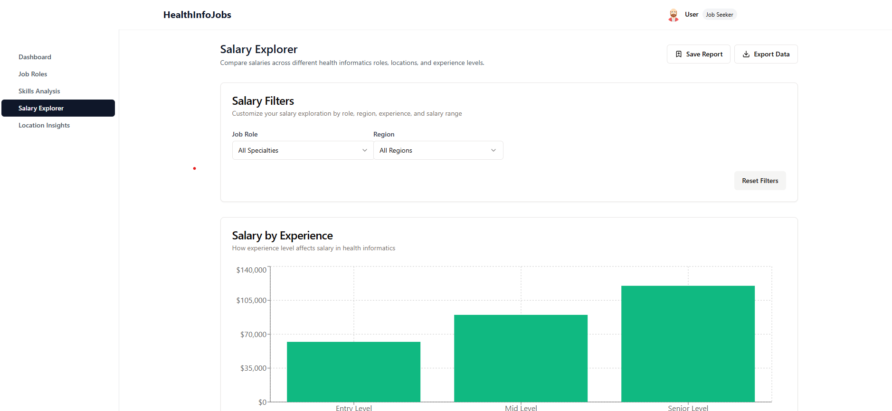
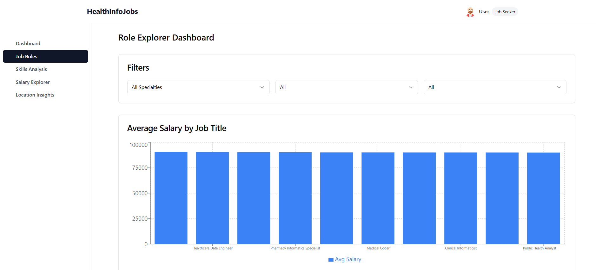
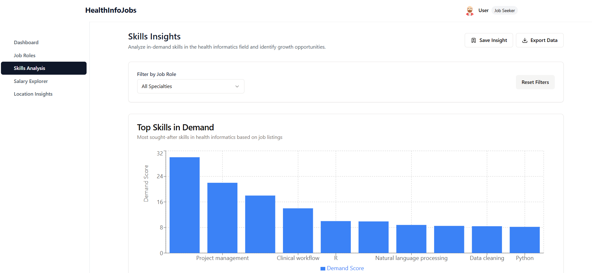

7# 📊 Health Informatics Dashboard

A modern, responsive web application built to explore, analyze, and visualize trends in the U.S. Health Informatics job market. This tool helps HR professionals, job seekers, and policy analysts make informed decisions by presenting real-time insights into job roles, skill demands, and salary distributions.

---

## 📚 Table of Contents

1. [Project Overview](#project-overview)
2. [Core Features](#core-features)
3. [Tech Stack](#tech-stack)
4. [Project Structure](#project-structure)
5. [Data Sources and Validation](#data-sources-and-validation)
6. [Application Setup and Usage](#application-setup-and-usage)
7. [Final Submission Checklist](#final-submission-checklist)
8. [Team Contributions](#team-contributions)
9. [License](#license)

---

## 📍 Project Overview

This Health Informatics Dashboard is designed to provide insightful, interactive data visualizations for understanding the healthcare job market in the U.S. It enables:

- Role-specific salary comparison
- Regional growth mapping
- Skill demand analysis
- Real-time filtering and data exploration

Built with modular components and clean UI principles, this dashboard bridges technical accuracy with user-friendly design.

---

## ⚙️ Core Features

- **🔎 Role Explorer** – Browse through health informatics job roles with growth trends, skill requirements, education level, and demand.
- **📈 Salary Explorer** – Compare entry, mid, and senior-level salaries across job titles, regions, and experience bands.
- **🧠 Skill Insights** – Evaluate top technical and soft skills required per category and role.
- **📊 Data Visualizations** – Recharts-based interactive charts for salaries, trends, and job comparisons.
- **🎚️ Filters** – Dynamic region, role, and experience level filters.
- **🔔 Toast Notifications** – Save insights or export data with feedback alerts.

---

## 🧠 Tech Stack

- **Frontend**: React + TypeScript
- **UI Styling**: Tailwind CSS + shadcn/ui components
- **Icons**: lucide-react
- **Data Handling**: @tanstack/react-query
- **Charts**: Recharts (BarChart, LineChart, AreaChart, ComposedChart)

---

## 🗂️ Project Structure

```
📁 src
 ┣ 📂 components         # UI components (cards, charts, layout)
 ┣ 📂 hooks              # Custom hooks (toasts, CSV parser)
 ┣ 📂 pages
 ┃ ┣ 📄 role-explorer.tsx     # Job role insights page
 ┃ ┣ 📄 skill-insights.tsx    # Skills visualization page
 ┃ ┗ 📄 salary-explorer.tsx   # Salary analysis page
 ┣ 📂 shared
 ┃ ┗ 📄 schema.ts        # Enum types and constants
```

---

## 🧾 Data Sources and Validation

### 📌 Source
- Dataset: `health_informatics.csv` (based on U.S. Bureau of Labor Statistics and curated job posting data)

### ✅ Validation & Transformation Logic
Performed in **Excel** with formulas and computed columns:

| Field | Description | Transformation Applied |
|-------|-------------|-------------------------|
| `Average Salary ($)` | Raw field in dataset | Used as baseline (Mid Salary) |
| `Entry Level Salary ($)` | Derived value | Mid Salary - 25% |
| `Senior Level Salary ($)` | Derived value | Mid Salary + 75% |
| `Lowest Salary ($)` | Derived value | Entry Salary - 2k–5k fuzzing |
| `Highest Salary ($)` | Derived value | Senior Salary + 2k–5k fuzzing |

All transformations were implemented using `ROUND()`, `*0.75`, `*1.75` formulas and stored in `health_informatics_variable_salaries.csv`.

No Jupyter Notebooks or Python scripts were used in this project.

---

## 🛠️ Application Setup and Usage

### 1. Clone Repository
```bash
git clone https://github.com/your-username/health-informatics-dashboard.git
cd health-informatics-dashboard
```

### 2. Install Dependencies
```bash
npm install
# or
yarn install
```

### 3. Start Local Development Server
```bash
npm run dev
# App will be available at http://localhost:5001
```

### 4. Build for Production
```bash
npm run build
```

### 5. Preview Production Build
```bash
npm run preview
```

---

## 📋 Final Submission Checklist

| Item | Description |
|------|-------------|
| ✅ Final Dataset | `health_informatics.csv` with validated fields |
| ✅ Excel Sheet | Includes formulas for salary calculations and validation steps |
| ✅ Codebase | Complete source code including filtering and charts |
| ✅ Application Build | Runs locally and builds successfully |
| ✅ Screenshots | Included below in `screenshots/` folder |

---
## 🖼️ Screenshots

- 
- 
- 

## 👨‍💻 Team Contributions

| Team Member | Responsibilities |
|-------------|------------------|
| **Jalandhar Bollam** | Requirement gathering, data modeling, salary band logic |
| **Prudhvi Kumar Borigam** | UI design, React component development, ER diagramming |
| **Srinivas Bandaru** | Excel-based data cleaning, job data transformation |
| **Abhinay Basani** | Chart integration, layout refinement, CSV handling |
| **Krishna Teja Reddy G.** | QA testing, filter logic validation, report formatting |

**Instructor:** Professor Maria Weber

---

## 📜 License

This project is licensed under the [MIT License](LICENSE).

---

Built with ❤️ by the IS-5960-03 Master’s Research Project Team.
